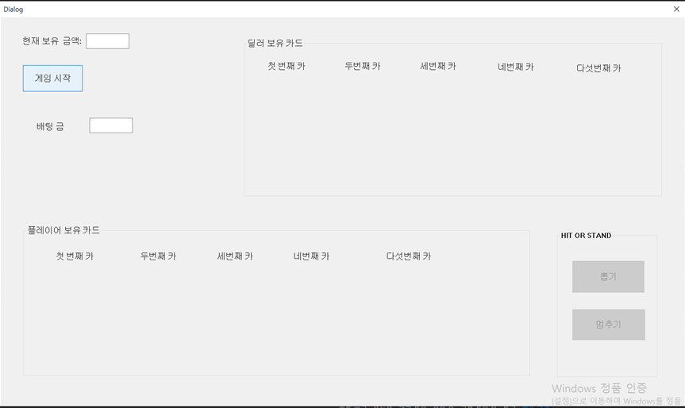
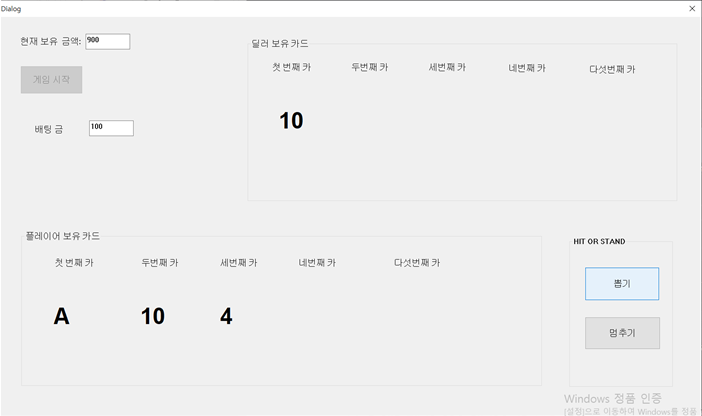
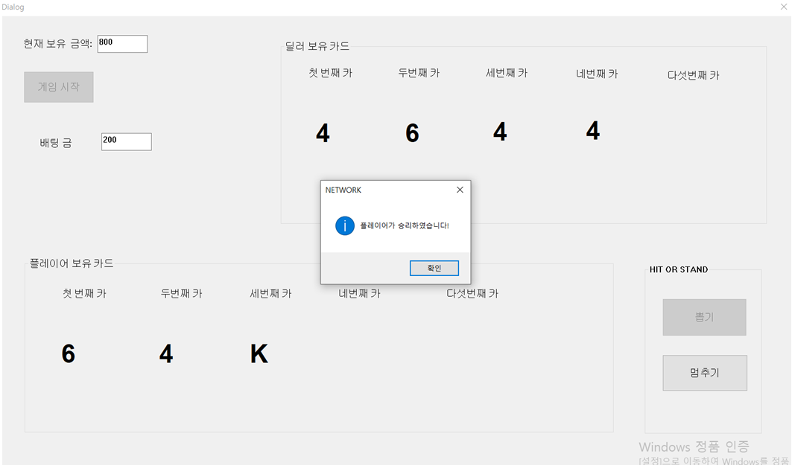
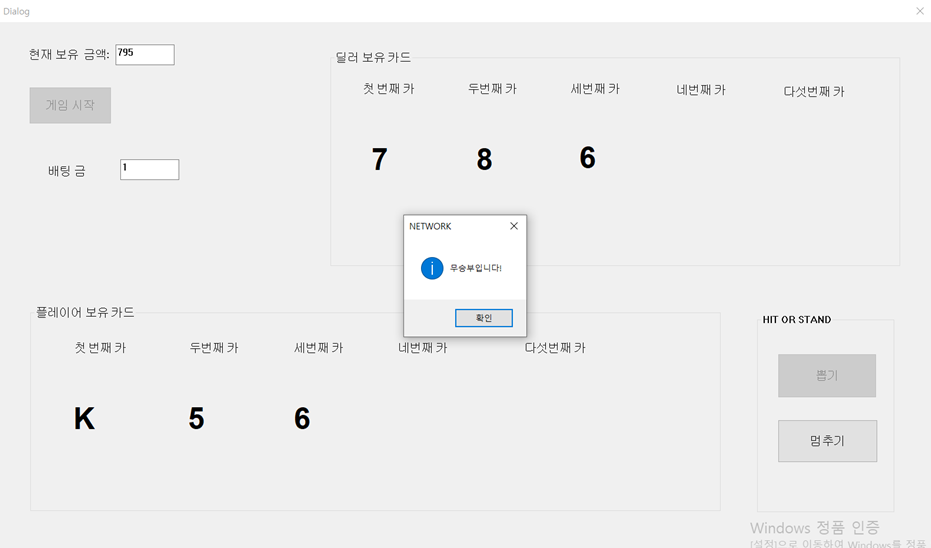

# 🎮 MFC Blackjack Network Game

TCP/IP 소켓 통신 기반의 멀티플레이 블랙잭 게임 프로젝트입니다.

---

## 📌 프로젝트 소개

MFC와 WinSock 기반으로 구현한  
서버-클라이언트 구조의 멀티플레이 블랙잭 게임입니다.

실시간 소켓 통신을 통해 카드 정보와 게임 상태를 동기화하였으며,  
배팅 시스템 및 승패 판정 기능을 구현했습니다.

비동기 소켓 이벤트 처리를 활용하여  
실시간 게임 진행이 가능하도록 설계하였습니다.

---

## 🛠 Tech Stack

### Language
- C++

### Network
- WinSock
- TCP/IP Socket

### GUI
- MFC

### Environment
- Visual Studio
- Windows

---

## ✨ 주요 기능

- TCP/IP 기반 서버-클라이언트 통신
- 실시간 카드 상태 동기화
- 블랙잭 게임 로직 구현
- 배팅 시스템 구현
- Hit / Stand 기능 구현
- 승리 / 패배 / 무승부 판정
- 게임 재시작 기능
- GUI 기반 게임 화면 구성

---

## 👨‍💻 담당 역할

- TCP/IP 소켓 통신 구현
- 서버-클라이언트 연결 기능 구현
- 블랙잭 게임 로직 구현
- 카드 상태 동기화 기능 구현
- GUI 화면 구성 및 이벤트 처리
- 게임 결과 판정 기능 구현

---

## 📷 Screenshots

### 🎲 Initial Game Screen

<p align="center">
  
</p>

---

### 🃏 Blackjack Gameplay

<p align="center">
  
</p>

---

### 🏆 Victory Result

<p align="center">
  
</p>

---

### 🤝 Draw Result

<p align="center">
  
</p>

---

## 🧩 Network Architecture

```txt
┌──────────────┐
│   Client     │
│ (MFC GUI)    │
└──────┬───────┘
       │
       │ TCP/IP Socket
       │
┌──────▼───────┐
│    Server    │
│ Game Manager │
└──────┬───────┘
       │
       │ Game State Sync
       │
┌──────▼───────┐
│ Blackjack    │
│ Game Logic   │
└──────────────┘
```
